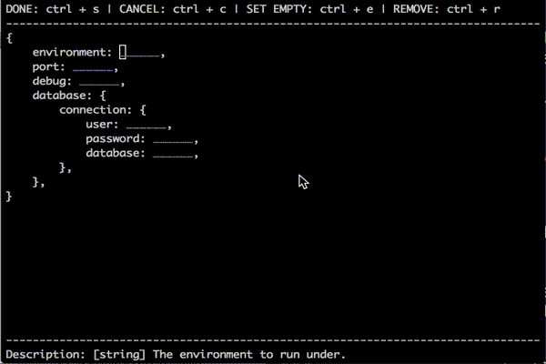

# config-template
Create server specific configuration files from a template via the command line.


### Use case

* Deploying your app to a new server via an automated script
* Installing your app on your dev machine for the first time
* Using a task runner (eg. gulp) to check if the config file exists and if not, prompting the user to create it before booting up the app.

Imagine you have a configuration file on your dev machine that looks like this:

`config.js`

```js
module.exports = {
	environment: 'development',
	port: 3000,
	devMode: true,
	database: {
		connection: {
			user: 'alarner',
			password: 'not a real password',
			database: 'test'
		}
	}
};
```

Whenever you want to deploy this app or set up a new dev, test or staging instance you'll want to tweak those values and set up a new config file. You'll also want to document all of the settings that are available and describe what they do. For example your config.template.js file might look like this:

`config.template.js`

```js
module.exports = {
	environment: '[string] The environment to run under.',
	port: '[number] The web server port.',
	debug: '[boolean] Show debug messages or not.',
	database: {
		connection: {
			user: '[string] Database user.',
			password: '[string] Database password.',
			database: '[string] Database name.'
		}
	}
};
```

Config loader can read a template file like the one above and provide a command line interface for creating that config file for the first time.

```js
var configTemplate = require('config-template');
var tpl = require('./config.template.js');

configTemplate(tpl).then(function(config) {
	console.log(JSON.stringify(config));
})

/*

{
	environment: 'development',
	port: 3000,
	devMode: true,
	database: {
		connection: {
			user: 'alarner',
			password: 'not a real password',
			database: 'test'
		}
	}
}

*/
```



## Supported data types

* string
* number
* boolean
* json

## Features

* Displays your customized description (from your template) of the config property when that property is selected.
* Basic data validation
* Ability to ignore / remove properties from the config object
* Set empty strings
* Color coding

## Todo

* unit tests
* horizontal scrolling